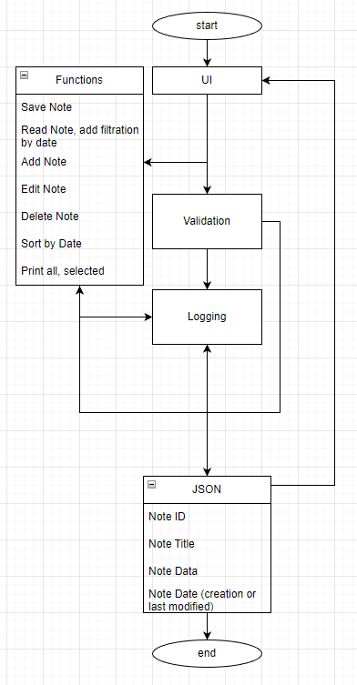

# Notes-app
Console app for managing notes

(🌟colorful info about the app🌟)

---

## How to use Notes app
1. Clone repository to your machine ```git clone *REP_LINK*```
2. Install python 3.11: [Python](https://www.python.org/downloads/)
3. Check if pip is installed on your machine ```pip --version```
4. Install pip if you don't have it installed: [pip documentation](https://pip.pypa.io/en/stable/installation/)
5. Install requirements: ```pip install -r requirements.txt```

---

## TODO:
- [x] [UI] : create UI, main menu
- [x] [Requirements] : create requirements.txt
- [x] [Create Test Data] : create JSON with some data
- [x] [Create Dir for data] : creation of directory for data storage
- [x] [Generate Data] : generate some data when app starting
- [x] [Read from file] : read data from json file
- [x] [Module pretty_print] : prints data to console
- [ ] [UI] : all menus
- [ ] [Validation] : validate the data input from user
- [x] [Logging] : logging module
- [ ] [Logging] : logging in app
- [x] [Filtration by date] : filter notes by date when reading from file
- [ ] [Save notes] : save data to file
- [x] [Print all] : print all notes to console
- [x] [Print selected] : print selected note to console
- [x] [Add note] : add new note to file
- [ ] [Delete note] : delete note from file
- [ ] [Edit note] : edit selected note
- [ ] [Module docs] : module documentation
- [ ] [Function docs] : function documentation
- [ ] [README] : edit readme documentation

---

### Project structure
1) app.py - app entrance point
2) main.py - controller
3) user_interface.py - main menu of the app
4) validator.py - validator of input data
5) file_worker.py - work with file (read, edit, save, delete)
6) pretty_print.py - printer to te console
7) logger.py - logging module
8) Data_store/ - directory for JSON file with notes
9) data_checker_and_filler.py - checker for files and directories to exist


